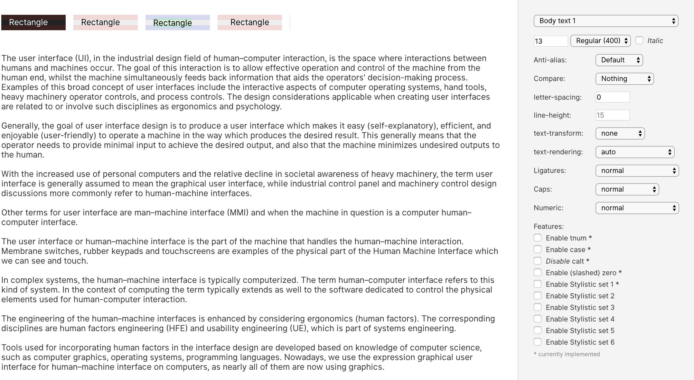

# Contributing to the Inter UI font project

First off, thank you for considering contributing to Inter UI.
It's people like you that make the Internet such a great place.

Following these guidelines helps to communicate that you respect the time of
the people managing and developing this open source project.
In return, they should reciprocate that respect in addressing your issue or
suggestion.

By contributing work to the Inter UI font project you agree to have all work
contributed becoming the intellectual property of the Inter UI font project as
described by [SIL Open Font License, Version 1.1](http://scripts.sil.org/OFL)


## Types of contributions this project is looking for

Inter UI is still an early product and so there is a lot of fun things to do.

- More glyphs! There are many placeholder glyphs that need to be replaced with
  ones designed in the style of Inter UI.
  - Non-English glyphs are especially needed

- Improvements and corrections to existing glyphs

- Kerning, kerning, kerning — there are so many pairs and pairs-in-words that
  need to be kerned, or have their kerning improved. When adding kerning, try
  to use `@GROUPS` (groups.plist in the UFO source directories.)

- A thin "master" font that can additionally be used to derive interpolated
  weights in between "regular" and "thin." This is a very large project and
  should probably be done in a branch over a longer period of time, rather than
  as one huge contribution/pull request.


### Master fonts and interpolated derivatives

This project uses "master fonts", or "key fonts" which are combined using
some clever math to generate other fonts that is a "mix" of two "masters."
Because of this, there are some **very important rules** you must stick to:

- When adding or removing a glyph, you _must_ add or remove the same glyph in
  all master fonts.
- When modifying a glyph's contours, the corresponding glyphs in all masters must:
  - Have the same amount of contours (aka "shapes")
  - Have the same amount of points in roughly the same locations
  - Each point must have the same amount and kind of handles
  - Each contour's winding direction must match

Unless these rules are followed, generated weights will fail to build.
If you are uncertain, simply try building a generated weight like "Medium" — the
build system will tell you when a glyph fails to "mix" with an error message.

To make life a little easier when working on glyphs, the build system will not stop
if there's a glyph-mixing error, but instead just pick a glyph from one of the
master weights and continue. For this reason you need to look at the output from
the build system and watch out for "mixglyph" error messages. They look like this:

```
mixglyph failed for J
```

> Note: There's currently one intentional mixglyph error for "quotedblbase" —
> please ignore this for now (also, feel free to fix it :) )


### Generated glyphs

Many glyphs which are based on basic latin characters are generated by composing
other glyphs. These are defined in `src/diacritics.txt` where each line of the
file defines one "composition" that names a base glyph followed by the name of
one or more additional glyphs, followed by anchor names which are used for alignment.

For example `Ά` U+0386 "GREEK CAPITAL LETTER ALPHA WITH TONOS" is composed from
`A` and `tonos`, aligned on the "tonos" anchor.
It's defined like this in `src/diacritics.txt`:

```
A+tonos:tonos=Alphatonos
```

"Alphatonos" is a glyph name defined in `src/glyphlist.txt` which maps names to
Unicode code points.

When you see a name starting with "uni" followed by some hexadecimal digits, that
means no symbolic name has been assigned to that glyph, but it maps to a Unicode
code point. For instance:

```
E+grave:top=uni0400
```

Creates Composes `Ѐ` U+0400 "CYRILLIC CAPITAL LETTER IE WITH GRAVE"
from "E" and "grave" aligned on the "top" anchor.

If we were to introduce a glyph named `uni0400` into the UFO source file, that
glyph would be used instead of the composition when a font is built. This allows
us to define a "baseline" of glyph compositions in `src/diacritics.txt` and then
progressively introduce specially-designed glyphs on a per font basis.

When doing this, you still have to be careful about the [master interpolation rules](#master-fonts-and-interpolated-derivatives).


### `src/fontbuild.cfg`

`src/fontbuild.cfg` defines a lot of things that directs the font build system.

- What glyphs to decompose (flatten; remove components)
- What glyphs should have a lesser italic angle when generating italic fonts
- What glyphs shouldn't be italicized at all when generating italic fonts
- What glyphs should be _excluded_ (or "removed") from resulting font files
  (some glyphs are only used as components and don't correspond to an actual
  glyph in the end-result font file.)
- Other information, like version, author, build system cache directory, etc.


## Building

Prerequisites:

- Python 2.7 with pip (you get pip with `brew install python`)
- [virtualenv](https://virtualenv.pypa.io/)

```
$ ./init.sh
```

This will generate makefile support, dependencies required by the toolchain, etc.
At the end, the script prints instructions for how to activate `virtualenv`.
As a convenience, you can also source init.sh to activate virtualenv.

We can now run `make` to build all font files:

```
$ make
```

Or just specific styles:

```
$ make Regular BoldItalic
```

Or all fonts but only TrueType format (no web file formats):

```
$ make all_ttf
```

Or just specific styles and formats:

```
# Regular in all formats, BoldItalic in only TrueType format
$ make Regular BoldItalic_ttf
```

You can also specify specific style + file format to `make` through `build/InterUI-STYLE.FORMAT`.
E.g.

- `make build/dist-unhinted/InterUI-MediumItalic.otf`
- `make build/dist/InterUI-Bold.woff2`
- `make build/dist/InterUI-Regular.ttf`
- `...`

All resulting font files are written to the `build` directory with `InterUI-` as the filename prefix.

Note: Making all files takes a considerable amount of time.
It's a CPU and I/O intensive task to compile the fonts and so the build system has been setup to
be able to run many jobs in parallel. Therefore it's recommended to pass the [`-j` flag to make](https://www.gnu.org/software/make/manual/html_node/Parallel.html) and
optionally pipe the fairly verbose output to /dev/null, e.g. `make -j 8 >/dev/null`.


### Editing

This font is stored and authored in the [Unified Font Object (UFO)](http://unifiedfontobject.org/) file format and can be edited by many different software, some free. However, it's only been "tested" with [RoboFont](http://robofont.com/) which is a popular commercial font editor. There's a 30 day fully-functional free trial version of the app, so you can use it for smaller contributions without needing to buy a RoboFont license.

To make life easier for you, configure RoboFont's settings like this:

- Set the grid to 128 units. This means that each grid square equals one pixel at 2x scale.
- Set "Snap points to" to a reasonably high number that's a power-of-two, like 8.
- Set "SHIFT increment" to 16
- Set "CMD SHIFT increment" to 128

When you've made an edit, simply save your changes and run make:

```
$ make
```

*For quick turnaround, consider:*

- Build and test only the "Regular" style.
- Use `misc/notify` to get desktop notifications on builds so that you don't have to sit and wait looking at the terminal while it's building.

E.g. `misc/notify make Regular`

See ["Building"](#Building) for more details.


### Preview & debug

This project comes with a simple web-based application for debugging and
previewing the font. It's a very useful tool to have when working on the font.

- Comes with a large body of sample text data (which is also editable.)
- Provides samples of the most common latin-script pairs, useful for kerning.
- Provides samples of words ordered by commonality in latin scripts with a
  preference for English (accessible via common-pair samples.)
- Can show the complete repertoire of the fonts, with correct glyph order and
  even RoboFont color labels ("marks").
- Controls for basic font properties like family, weight, italic, size,
  line-height, letter-spacing, etc.
- Controls for a lot of font features like ligature sets, contextual alternates,
  alternate numerics, etc.
- Controls for web-browser text features like `capitalize`, `uppercase`,
  `lowercase`, etc.
- Ability to compare Inter UI side-by-side with other fonts.



The following will start a local web server (which is only accessible from your local computer; not the internet) that serves the debug-and-preview app:

```
$ docs/serve.sh &
```

You can now visit `http://localhost:2015/lab/`.
After you rebuild some font files, reload the web page to refresh fonts.


## FAQ

> Do I need RoboFont?

No, you don't. To build font files, all you need is Python. To edit the font files, you need something that can edit UFO files (like [RoboFont](http://robofont.com/) or a text editor.)

----

> `KeyError: 'Lj'` when building

This probably means that you need to run `./init.sh` to setup the case-sensitive virtual file system mount that is needed by the font build system. Unfortunately the toolchain used (which is the same as for Roboto) requires not only a case-preserving file system, but also a case-sensitive one.

----

> `ImportError: No module named robofab.objects.objectsRF`

Python virtualenv not configured. Run `. init.sh`

----

> `make: *** No rule to make target ...`

Run `./init.sh` to update the generated makefile.

----

> How can I inspect a compiled font file?

Use the fontinfo.py tool which outputs JSON describing all properties of
one or more font files.
See `misc/fontinfo.py -h` for details.
Example use: `misc/fontinfo.py build/dist/InterUI-BoldItalic.ttf`
