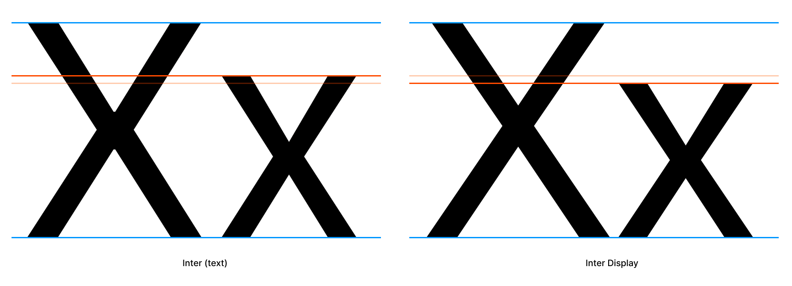

# Contributing to the Inter font project

First off, thank you for considering contributing to Inter.
It's people like you that make the Internet such a great place.

Following these guidelines helps to communicate that you respect the time of the people managing and developing this open source project. In return, they should reciprocate that respect in addressing your issue or suggestion.

By contributing work to the Inter font project you agree to have all work contributed becoming the intellectual property of the Inter font project as described by [SIL Open Font License, Version 1.1](http://scripts.sil.org/OFL)


## Types of contributions this project is looking for

- [Reporting issues](https://github.com/rsms/inter/issues/new?template=bug_report.md)
  like bad kerning pairs or variable-font interpolation bugs.

- Fixes to
  [issues tagged "help wanted"](https://github.com/rsms/inter/issues?q=is%3Aissue+is%3Aopen+label%3A%22help+wanted%22)
  provided as either
  [GitHub pull requests](https://github.com/rsms/inter/pulls)
  or comments in the issue.

- Improvements to the Display "opsz" designs...


### Improvements to the Display "opsz" designs

The Display (`opsz=32`) designs was derived from the text family ("Inter") and scaled to a different UPM (2048). It also had all of its kerning reduced.

Inter Display has a lower x-height compared to the text (`opsz=16`) designs — this is the biggest difference in terms of work needed.



> Please do not email Rasmus with issues and contributions but use GitHub 🙏


## Master fonts and interpolated derivatives

This project uses "master styles" (or "key styles") which are combined using some clever math to generate other styles that are "mixed" from two masters. Because of this, there are some **very important rules** you must stick to:

- When adding or removing a glyph, you _must_ add or remove the same glyph in all master fonts. If you're using Glyphs.app, this is automatically taken care of, but not with RoboFont or some other font tools.
- When editing glyphs we must make sure:
    - all masters have the same amount of paths, nodes and handles, as well as components.
    - all components, paths, nodes and handles are in the same order across all masters.
    - all masters have the same set of anchors.

If these rules are not followed, generated styles will fail to build.

[Multiple Masters: Keeping Your Outlines Compatible](https://glyphsapp.com/tutorials/multiple-masters-part-2-keeping-your-outlines-compatible) is a great article on this topic.


## Compiling font files

The Inter toolchain is a collection of programs setup to build everything
in a high-quality and reliable way. It can be fully automated and requires no
paid software.

To build everything:

```
make -j all
```

Run QA tests:

```
make test
```

Currently the toolchain has only been tested on macOS and Linux. All you need to have preinstalled is [Python 3](https://www.python.org/downloads/).


### Recommended development workflow

Open two terminals: in one, run a local web server with `./docs/lab/serve.py`. In the other run `make`:

1. Edit in Glyphs.app
2. Run `make var_web`
3. Reload the lab at `http://localhost:3003/?varfont=1`
4. Repeat

Before submitting a Pull Request or otherwise contribute your changes:

1. `make clean && make -j all` then thoroughly inspect your changes in a variety of different settings using the lab and in any relevant software.
2. Run QA tests using `make -j test`


### Try & sample as you go

When making changes to the typeface and its source files, it's a good idea to sample your changes not only in a font editor or graphics editor, but also in real-world scenarios.

There are two things in particular that will help you with this:

- `make -j build/fonts/FILENAME` to quickly compile only a particular font file
- Interactive "Lab"

You can invoke `make` with either names of styles, names of styles and file formats, or even specific filenames. Here are a few examples:

```sh
make -j build/fonts/static/Inter-Regular.otf \
        build/fonts/static/Inter-MediumItalic.woff2
make -j static_otf  # all non-variable OTF fonts
make -j build/fonts/static-hinted/Inter-ExtraLight.woff2
```

All resulting font files are written to the `build` directory with `Inter-` as the filename prefix. The `Makefile` file contains information about more possibilities of `make`.

[**The interactive Lab**](#interactive-lab) is a great tool for quickly exploring your font files. It's a web-based tool which you start in a terminal by running:

```
./docs/lab/serve.py
```

Open up the URL printed on the screen and you can now explore your font files.

See [Interactive Lab](#interactive-lab) for more details.


### Editing source files

This font is stored and authored primarily in the [Glyphs](https://glyphsapp.com/)
`Inter.glyphspackage` directory (a macOS "bundle.")


#### Editing UFO sources

In some cases you might want to edit or inspect the fonts as UFOs.
Inter is compiled to UFO as an intermediary step.

The quickest path to UFOs is to run `make -j$(nproc) build/ufo/Inter-DisplayMedium.ufo`. Substitute "Inter-DisplayMedium.ufo" for any style.

The quickest path to a designspace is to run `make -j$(nproc) build/ufo/Inter-Roman.designspace`

However, if you indend to edit the fonts you probably want to use the `editable-ufos` make target instead:

    make -j$(nproc) editable-ufos

This generates all designspaces and UFOs, suitable for editing, in `build/ufo-editable/`. The main difference between `editable-ufos` and the intermediary UFOs in `build/ufo/` is that the "editable" ones does not have any processing applied to them: all components, anchors and paths are represented as-is in the original Glyphs source.


### Interactive Lab

This project comes with a simple web-based application for debugging and previewing the font. It's a very useful tool to have when working on the font.

- Comes with a large body of sample text data (which is also editable.)
- Provides samples of the most common latin-script pairs, useful for kerning.
- Provides samples of words ordered by commonality in latin scripts with a
  preference for English (accessible via common-pair samples.)
- Can show the complete repertoire of the fonts, with correct glyph order and
  even RoboFont color labels ("marks").
- Controls for basic font properties like family, weight, italic, size,
  line-height, letter-spacing, etc.
- Controls for a lot of font features like ligature sets, contextual alternates,
  alternate numerics, etc.
- Controls for web-browser text features like `capitalize`, `uppercase`,
  `lowercase`, etc.
- Ability to compare Inter side-by-side with other fonts.

To start the lab, simply run this in a terminal (and keep the terminal running.)

```
./docs/lab/serve.py
```

You can now visit the URL printed on the screen to use the lab. Simply `make -j web` for all styles or `make var_web` for quickly building only the variable font. Then reload the web page to try the new build.

An online version of the lab is available at <https://rsms.me/inter/lab/> with the most recent official release of the Inter font files.


### Kerning

Kerning is the concept of harmony in the pace of characters, defined as a set of distances between specific character pairs, like "A" & "c". Good kerning makes words more readable. Oftentimes this means that when adjusting kerning, you have to look at whole words and sentences when adjusting the kerning of a pair, since the spacing between two characters should work in harmony with the spacing of all other characters.

All major font editors provide user interfaces for previewing and adjusting kerning. There is even dedicated software specifically for working with kerning.

When adding kerning, use _kerning groups_ rather than specific pairs.

- If you're using Glyphs, read more about kerning and how the "padlock" icon affects kerning specific pairs vs groups here: <https://glyphsapp.com/tutorials/kerning>
- If you're editing the UFO files, the groups can be found in the `groups.plist` files.

If a glyphname is missing in kerning groups, define a new group for it. Group name should reflect the most prominent or common glyph that belongs to the group. For example, "V" for a group containing "Y", "Ÿ", "V" and "W". A kerning group is specific to one "side" of a glyph (left or right) and therefore the name should reflect a glyph which side is the most relevant one. For instance, consider the character "D" which on the left side looks like "M" and "L" but on the right side looks like "O" and "C". It belongs to the "O left" group and the "M right" group. Similarly for "g" ("o left", "m right"), "p" ("m left", "o right") and many other glyphs.

Kerning groups is a really simple but incredibly time-saving way of kerning a font.

> Tip: Include sample images of kerning adjustments with code pull requests that affect kerning.

The script `misc/tools/kernsample.py` is helpful in generating samples for all existing right-hand side characters given a left-hand side glyphname.

```txt
$ misc/kernsample.py src/Inter-Black.ufo P -suffix MOR
PAMOR P/AE MOR PJMOR PXMOR PYMOR PZMOR P/ae mor P/ampersand mor
P/backslash mor P/dzcaron mor P/eightsub mor P/ellipsis mor Pfmor
P/four mor P/guilsinglleft mor P/idieresisacute mor P/periodcentered
mor P/quotedblbase mor Psmor P/seven mor P/slash mor Ptmor P/two
mor P/underscore mor Pymor
```

Type `misc/tools/kernsample.py -h` for help on how to use the program.

This only includes existing kerning and is thus only useful for adjustments. Additions must still be done manually.


### Performance profiling

`fontbuild` has a `--profile=<file>` option built in which when provided profiles the execution
and writes a pstat file. Example:

```
misc/fontbuild --profile=build/tmp/1.pstat compile -o build/tmp/f.otf build/ufo/Inter-Regular.ufo
```

You can print pstat files with the `fmtprofile.py` tool:

```
misc/tools/fmtprofile.py -n 20 build/tmp/1.pstat
```

You can inspect pstat files interactively with the `pstats` module:

```
python3 -m pstats build/tmp/1.pstat
```

For profiling Python programs that are not fontbuild, you can do this:

```
python -m cProfile -o 1.pstats -s time script.py
```

See <https://docs.python.org/3/library/profile.html> for more information about profiling
Python programs.


### Miscellaneous tools

There are several tools included with Inter to help "wrangle" metrics, generate glyphs, create PDFs and so on. You can find these tools in the `misc/tools` directory. They are all command-line tools and their usage can be queried by providing the help flag `-h`.

For example, the fontinfo tool can be used to generate a JSON description of all metadata and merics of a TTF or OTF file:

```
misc/tools/fontinfo.py -h
```


## FAQ

> Do I need Glyphs to build font files?

No, you don't. To build font files, all you need is Python. To edit the font files, you need something that can edit .glyphs or UFO files.

----

> I'm getting errors when running `make` in my terminal

Try `make reset`

