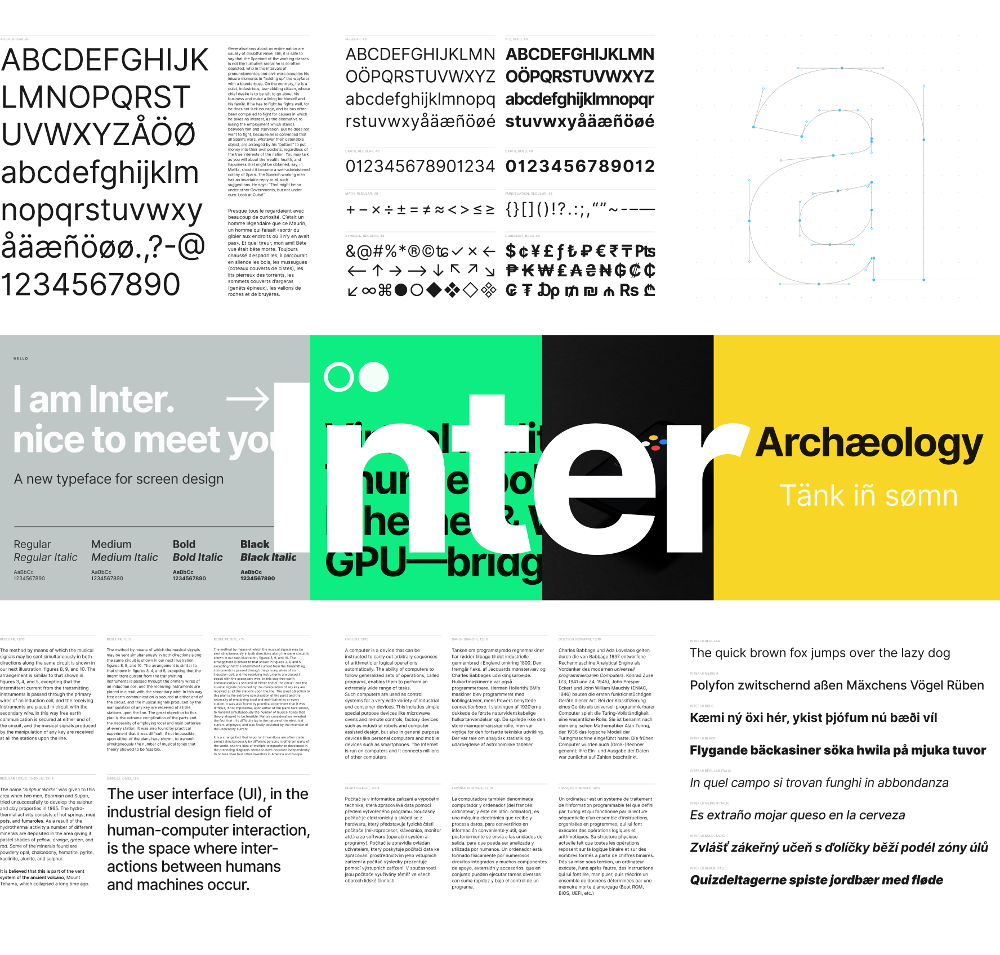
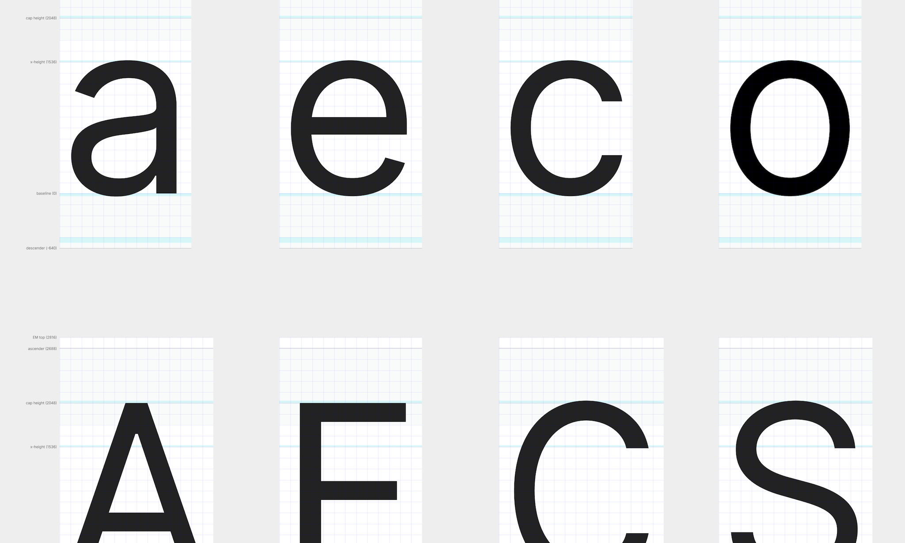
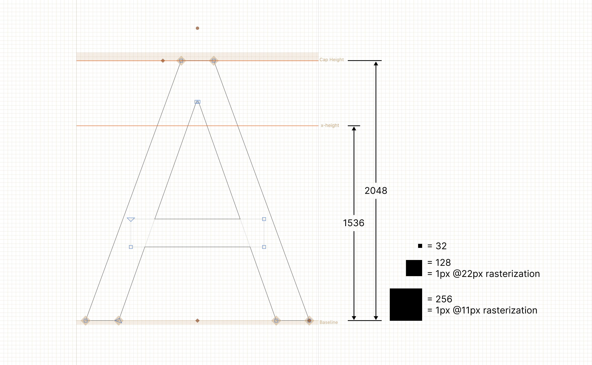

# Inter

Inter is a typeface specially designed for user interfaces
with focus on high legibility of small-to-medium sized text on computer screens.

The family features a tall x-height to aid in readability of mixed-case and
lower-case text. Several OpenType features are provided as well,
like contextual alternates that adjusts punctuation depending on the shape of
surrounding glyphs, slashed zero for when you need to disambiguate "0" from "o",
tabular numbers, etc.

### [⬇︎ Download the latest release](https://github.com/rsms/inter/releases/latest)

After downloading the zip from above:

1. Double-click the downloaded zip file to unpack or open it.
2. Follow the instructions in "install-mac.txt" or "install-win.txt", depending
   on what operating system you're using.

Font files are also available from the following third-party distributors:

- [`inter-ui` on npm](https://www.npmjs.com/package/inter-ui)
- [`font-inter` in Homebrew's Fonts cask](https://github.com/Homebrew/homebrew-cask-fonts)
- See [Repology](https://repology.org/project/fonts:inter/versions) for a list of Linux distributions that include the font in their repositories.

**Disclaimer:** Third-party packages may not always be up-to-date.

## Design

Inter is similar to Roboto, San Francisco, Akkurat, Asap, Lucida Grande and other "UI" and "Text" typefaces. Some trade-offs were made in order to make this typeface work really well at small sizes:

- Currently not suitable for very large sizes because of some small-scale glyph optimizations (like "pits" and "traps") that help rasterization at small sizes but stand out and interfere at large sizes.
- Rasterized at sizes below 12px, some stems—like the horizontal center of "E", "F", or vertical center of "m"—are drawn with two semi-opaque pixels instead of one solid. This is because we "prioritize" (optimize for) higher-density rasterizations. If we move these stems to an off-center position—so that they can be drawn sharply at e.g. 11px—text will be less legible at higher resolutions.

Current font styles:

| Name                 | Weight class
| -------------------- | ----------------
| Thin                 | 100
| Thin Italic          | 100
| Extra Light          | 200
| Extra Light Italic   | 200
| Light                | 300
| Light Italic         | 300
| Regular              | 400
| Italic               | 400
| Medium               | 500
| Medium Italic        | 500
| Semi Bold            | 600
| Semi Bold Italic     | 600
| Bold                 | 700
| Bold Italic          | 700
| Extra Bold           | 800
| Extra Bold Italic    | 800
| Black                | 900
| Black Italic         | 900

Inter also ships as a variable font.

### Font metrics

This font was originally designed to work at a specific size: 11px. Thus, the Units per [EM](https://en.wikipedia.org/wiki/Em_(typography)) (UPM) is defined in such a way that a power-of-two multiple of one EM unit ends up at an integer value compared to a pixel. Most fonts are designed with a UPM of either 1000 or 2048. Because of this we picked a value that is as high as possible but also as close as possible to one of those common values (since it's reasonable to assume that some layout engines and rasterizers are optimized for those value magnitudes.) We ended up picking a UPM of 2816 which equates to exactly 256 units per pixel when rasterized for size 11pt at 1x scale. This also means that when rasterized at power-of-two scales (like 2x and 4x) the number of EM units corresponding to a pixel is an integer (128 units for 2x, 64 for 4x, and so on.)

However, as the project progressed and the typeface was put into use, it quickly
became clear that for anything longer than a short word, it was actually hard to
read the almost monotonically-spaced letters.

A second major revision was created where the previously-strict rule of geometry being even multiples of 256 was relaxed and now the rule is "try to stick with 128x, if you can't, stick with 64x and if you can't do that either, never go below 16x." This means that Inter is now much more variable in pace than it used to be, making it work better at higher resolutions and work much better in longer text, but losing some contrast and sharpness at small sizes.

The glyphs are designed based on this "plan"; most stems and lines will be positioned at EM units that are even multiples of 128, and in a few cases they are at even multiples of 64 or as low as 16.

A UPM of 2816 is great for Inter since that means that its cap height is exactly 2048 units (64× 32-unit squares) and its x-height is 1536 (48× 32-unit squares) which both makes the design easier (can deal with only integers, never any fractions, plus use a perfect grid) and it makes the target "small size" of 11dp a pixel-perfect match — at 11px rasterization 1 pixel is exactly 256 units in the design! At 11dp with a 2x scaling factor 1 pixel is 128 units, 64 units at a 3x scaling factor and so on. This makes it feasible to really tune Inter for detailed rasterization.

Metrics:

- UPM:        2816
- Descender:  -680
- Cap height: 2048
- x-height:   1536
- Ascender:   2728

Translating between EM units and pixels:

- Rasterized at 11px: 1px = 256 units
- Rasterized at 22px: 1px = 128 units
- Rasterized at 44px: 1px =  64 units

There's a Figma workspace for glyphs, with configured metrics: ["Inter glyphs"](https://www.figma.com/file/RtScFU5NETY3j9E0yOmnW4gv/)

## Supporters

A wholehearted **Thank You** to everyone who supports the Inter project!

### Sponsors

- @adrianmg
- @artemc
- @bapun26
- @brianlovin
- @chadlittle
- @colinkeany
- @danrowden
- @davo
- @emuravjev
- @gbougakov
- @jakejarvis
- @lukesbeard
- @lustfullyCake
- @mamuso
- @mbullington
- @muuvmuuv
- @NetOperatorWibby
- @pedromvpg
- @pmarsceill
- @romashamin
- @ruslangirichev
- @saishmenon
- @satyakresna
- @sorentwo
- @StandardResumeSponsors
- @stpnkcrk
- @taravancil
- @usmanity
- @zethussuen
- Stefan Kempf

_(Private donors excluded)_

### Main contributors

- @thundernixon
- @KatjaSchimmel

See [graphs/contributors](https://github.com/rsms/inter/graphs/contributors)
for a complete list of all contributors.

## Development

For instructions on how to work with the source files and how to
[compile & build font files](CONTRIBUTING.md#compiling-font-files),
refer to [CONTRIBUTING.md](CONTRIBUTING.md).

Inter is licensed under the [SIL Open Font License](LICENSE.txt)
